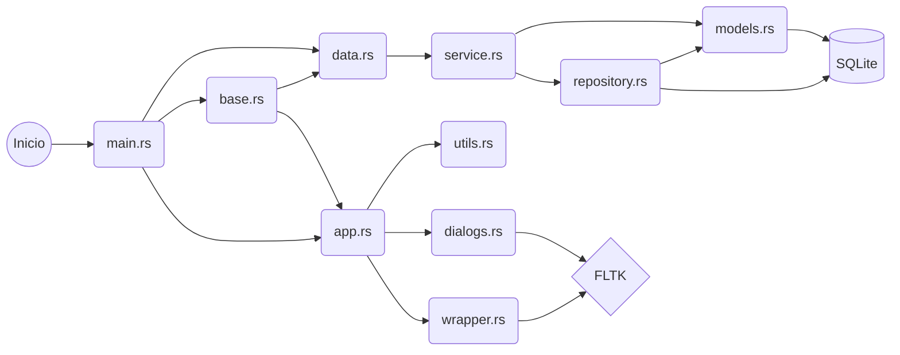

# Wohnen

Wohnen es una aplicación de escritorio desarrollada en el lenguaje de programación [Rust](https://www.rust-lang.org) como parte del _Curso Introducción a Rust_ dictado por [Polkadot](https://polkadot.network). El objetivo principal de este proyecto es proporcionar una funcionalidad completa para gestionar entidades de tipo Vivienda, permitiendo la inclusión, modificación, eliminación, consulta y búsqueda de viviendas con diferentes atributos utilizando una base de datos SQL para la persistencia.

## Arquitectura

Wohnen sigue una arquitectura diseñada en base a los conceptos aprendidos durante el curso. Se ha implementado un enfoque orientado a objetos utilizando patrones de diseño para organizar el código y estructurar las características de la aplicación.

La arquitectura de Wohnen se compone de las siguientes partes:

- **app**: Este módulo contiene las funciones necesarias para crear la interfaz (`app.rs`) como así también para crear las ventanas de diálogo personalizadas (`dialogs.rs`) y una estructura para abstraer las funcionalidades principales de los widget de FLTK (`wrapper.rs`).

- **data**: Este módulo está compuesto por un servicio (`service.rs`) el cual implementa el trait DAO para tener una separación entre el acceso a la información en la base de datos SQLite y la interfaz gráfica FLTK. Este servicio utiliza un repositorio (`repository.rs`) el cual implementa la lógica de acceso a la base de datos usando _diesel_ cuyos modelos de información están en el archivo `models.rs`.

- **base**: Este archivo contiene la abstracción DAO, para que la interfaz gráfica no dependa de _diesel_, además contiene una estructura para poder realizar el filtrado o búsqueda por cada tipo de características de las viviendas.

- **main**: Este archivo es el punto de inicio en el cual se crea una instancia que implementa `DAO` para pasársela a la instanciación de `Gui` e iniciar la interfaz.

El nombre "Wohnen" es una palabra en alemán que significa "vivir". Se eligió este nombre para reflejar la funcionalidad central del proyecto, que es gestionar entidades de viviendas.

## Bibliotecas utilizadas

A continuación, se enumeran las bibliotecas (crates) utilizadas en el proyecto:

- **fltk**: Biblioteca FLTK utilizada para construir la interfaz de usuario y manejar eventos de la ventana.

- **fltk-theme**: Tema adicional para FLTK que mejora la apariencia visual de la aplicación.

- **diesel**: Biblioteca de mapeo objeto-relacional (ORM) utilizada para interactuar con la base de datos SQLite y ejecutar consultas.

- **diesel_migrations**: Crate utilizado junto con Diesel para facilitar la migración de la base de datos y realizar cambios en el esquema de manera automática.

- **dotenvy**: Biblioteca que permite cargar variables de entorno desde un archivo `.env`, el cual es utilizado para configurar la conexión con la base de datos.

- **strsim**: Crate que proporciona funciones para el cálculo de la similitud entre cadenas de texto. Se utiliza una combinación de los métodos de la distancia de Jaro–Winkler y el coeficiente de Sørensen–Dice para la búsqueda aproximada del texto de las direcciones de las viviendas.

- **unidecode**: Crate utilizado para eliminar acentos y convertir caracteres unicode en su forma ASCII equivalente, el cual es usado junto a **strsim**.

## Limitaciones asumidas y mejoras futuras

Aunque Wohnen cumple con todos los requisitos establecidos para el proyecto, existen algunas limitaciones y áreas de mejora que se pueden abordar en futuras versiones:

- Actualmente, al realizar operaciones como eliminar o modificar viviendas, no se solicita una confirmación al usuario antes de realiza las acciones. Se podría implementar una confirmación previa para evitar cambios accidentales.

- La consulta a la base de datos no implementa paginado, lo que podría ser problemático si se manejan grandes volúmenes de datos. Sería beneficioso implementar un paginado para mejorar el rendimiento y la experiencia del usuario.

- Al modificar una vivienda, actualmente se actualiza toda la interfaz y los datos pertinentes por completo. Se podría optimizar para actualizar solo los elementos que han cambiado, lo que reduciría la carga y mejoraría la capacidad de respuesta de la aplicación con grandes volúmenes de datos.

- Si los datos de una vivienda han cambiado, o se está creando una nueva, y se selecciona otra vivienda del navegador de viviendas, los cambios se pierden. Debería implementarse una confirmación previa para evitar pérdidas de datos.

- El manejo de los errores también debería mejorarse para manejar todos los casos posibles, sin embargo junto a la abstracción entre base de dato y la interfaz también se desacopló los Errores que se manejan entre `repository.rs` y `service.rs`.
